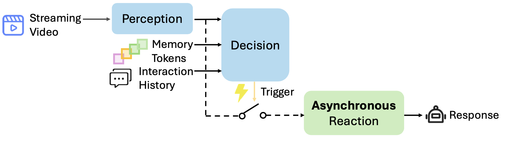

# Dispider

Official implementation of **Dispider: Enabling Video LLMs with Active
Real-Time Interaction via Disentangled Perception, Decision, and Reaction**
(CVPR 2025).

<p align="center">
  <a href="https://arxiv.org/abs/2501.03218">Paper</a> ·
  <a href="assets/paper.pdf">PDF</a> ·
  <a href="https://huggingface.co/Mar2Ding/Dispider">Checkpoint</a>
</p>



Dispider continuously perceives a video, decides when the user's instruction
requires a response, and invokes the larger Reaction model only after a
trigger. The repository provides offline inference, incremental inference with
timestamped answers, an optional Decision KV cache, and an OVO-Bench evaluator.

## Model structure

| Component | Purpose | Implementation |
| --- | --- | --- |
| Perception | Encode each sampled 16-frame clip | CLIP vision tower |
| Perception-Decision | Build temporal memory from clip features | Compact Qwen2-1.5B |
| Decision | Trigger or remain silent | Decision head on the compact model |
| Reaction | Generate an answer after a trigger | Qwen2-7B |

Standard Qwen2 layers, attention, RoPE, and generation come from the pinned
Transformers release. The repository keeps only Dispider-specific perception,
memory, decision, streaming, and reaction inference logic. Training objectives
and trainer code are intentionally not included.

```text
dispider/model/
├── __init__.py
├── builder.py                 # checkpoint loader
├── checkpoint.py              # portable checkpoint validation
├── perception.py              # CLIP Perception
├── perception_decision.py     # compact-model facade
├── decision.py                # public Decision model
├── decision_inputs.py         # visual/token input assembly
├── reaction.py                # Reaction and memory interleaving
├── projectors.py              # released projector types
└── decision_backbone/
    ├── adapter.py             # thin Transformers Qwen2 adapter
    ├── constants.py           # token roles and thresholds
    ├── memory.py              # temporal memory operations
    ├── streaming.py           # online Decision paths
    └── model.py               # Decision LM shell
```

The public model API consists of `Perception`, `PerceptionDecision`,
`Decision`, and `Reaction`.

## Installation

The validated environment uses Python 3.10, CUDA 12.1, PyTorch 2.2.0+cu121,
FlashAttention 2.5.9.post1, and Transformers 4.41.2.

```bash
conda create -n dispider python=3.10 -y
conda activate dispider

pip install torch==2.2.0 torchvision==0.17.0 torchaudio==2.2.0 \
  --index-url https://download.pytorch.org/whl/cu121
pip install flash-attn==2.5.9.post1 transformers==4.41.2 \
  accelerate==0.27.2 decord huggingface_hub safetensors pillow
```

Run commands from the repository root so that the local `dispider` package is
on `PYTHONPATH`.

## Checkpoint

Download the portable checkpoint:

```bash
huggingface-cli download Mar2Ding/Dispider \
  --local-dir checkpoints/Dispider
```

The composite shards contain Reaction, Perception-Decision, Decision, and the
vision tower exactly once. Nested directories contain only configuration,
tokenizer, and image-processor metadata.

```text
Dispider/
├── config.json
├── dispider_checkpoint_manifest.json
├── model-00001-of-00004.safetensors
├── model-00002-of-00004.safetensors
├── model-00003-of-00004.safetensors
├── model-00004-of-00004.safetensors
├── model.safetensors.index.json
└── perception_decision/
    ├── config.json
    ├── tokenizer metadata
    └── vision_tower/
        ├── config.json
        └── preprocessor_config.json
```

## Offline inference

```bash
CUDA_VISIBLE_DEVICES=0 python inference.py \
  --model_path Mar2Ding/Dispider \
  --video_path /path/to/video.mp4 \
  --prompt "What is happening in the video?"
```

The Python API is `VideoStream(model_path).run(video_path, prompt)`.

## Streaming inference with timestamps

The streaming entry point decodes incrementally, processes one 16-frame window
at a time, and emits a JSON line whenever Decision triggers Reaction:

```bash
CUDA_VISIBLE_DEVICES=0 python stream_inference.py /path/to/video.mp4 \
  --model Mar2Ding/Dispider \
  --prompt "Tell me when the person starts performing." \
  --decision-kv-cache auto \
  --decision-trace outputs/decision_trace.jsonl
```

```json
{"timestamp_s": 15.516, "timestamp": "00:00:15.516", "answer": "The performance has started."}
```

`--decision-kv-cache auto` enables the cache when supported, `on` requires it,
and `off` recomputes Decision from the full observed stream. `--verify-cache`
compares cached scores with the full-computation oracle. Near the trigger
threshold, the runtime automatically uses the oracle score.

For a live decoder or camera, create a `DispiderStreamingAdapter`, call
`new_session()`, and feed monotonically increasing frame timestamps through
`session.push_frames(frames, timestamps)`.

## Example Evaluation on OVO-Bench

Prepare the evaluator and pre-chunked videos:

```bash
git clone https://github.com/JoeLeelyf/OVO-Bench.git ../OVO-Bench
git -C ../OVO-Bench checkout c34093f
pip install -r ../OVO-Bench/requirements.txt
```

Run the call-balanced multi-GPU evaluator:

```bash
python scripts/evaluate_ovobench.py \
  --ovo-root ../OVO-Bench \
  --model-path checkpoints/Dispider \
  --data-root /path/to/ovo-data \
  --output-dir outputs/ovobench \
  --gpus 0,1,2,3 \
  --resume
```

The evaluator validates all expected rows and inference calls, resumes only
complete matching shards, rejects missing or null predictions, and computes
the official category metrics. Outputs remain under the local `--output-dir`.
See [the evaluation protocol](docs/OVOBENCH_EVALUATION.md) for details.

## License and citation

The code and checkpoint metadata use the Apache License 2.0.

```bibtex
@inproceedings{qian2025dispider,
  title={Dispider: Enabling Video {LLMs} with Active Real-Time Interaction via Disentangled Perception, Decision, and Reaction},
  author={Qian, Rui and Ding, Shuangrui and Dong, Xiaoyi and Zhang, Pan and Zang, Yuhang and Cao, Yuhang and Lin, Dahua and Wang, Jiaqi},
  booktitle={Proceedings of the Computer Vision and Pattern Recognition Conference (CVPR)},
  pages={24045--24055},
  month={June},
  year={2025}
}
```
